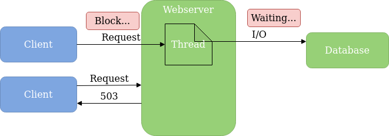
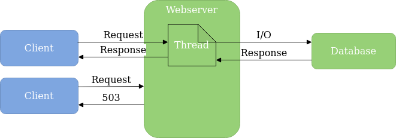
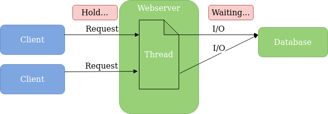
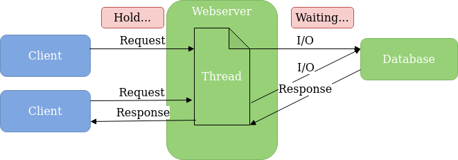
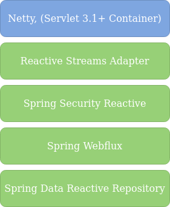

### Was ist reaktive Programmierung

Paradigma für 

non-blocking, asynchrone und Event getriebene 

Anwendungen mit Fokus auf

Skalierbarkeit und Stabilität 

und nicht Zeitverhalten

<-->

### Grundlegende Konzepte

* Asynchronität

* Reactive Streams

* Backpressure
  
* Immutability

* Funktionale Programmierung

<-->

### Wie werden Requests abgearbeitet

<-->

### Wie werden Requests abgearbeitet

<-->

### Wie werden Requests abgearbeitet

<-->

### Wie werden Requests abgearbeitet

<-->

### Einsatzszenarien

* Gateways

* Verarbeitung von sehr vielen Requests

* Service mit vielen externen Serviceaufrufen

* nebenläufige Messageverarbeitung

<--->

### Was bietet Spring

zwei Bibliotheken auf Basis Project Reactor 

* Spring Webflux 

* Spring Cloud Gateway

<-->

### Spring Reactive Stack

<--->

### Was sind Mono und Flux

* Mono: Stream, der nur ein Ergebnis liefert
  * ein Wert + Complete
  * Fehler

* Flux: Stream, der 0-n Ergebnisse liefert
  * 0-n Werte + Complete
  * 0-n Werte + Fehler 

<--->

### Codebeispiel

<--->

### Hinweise

Grundprinzipien verstehen!

Keine Blocking-Aufrufe in Code!

Debugging/Fehleranalyse lernen!

Verwendung gut überlegen!

<!-- .element: class="fragment" -->
